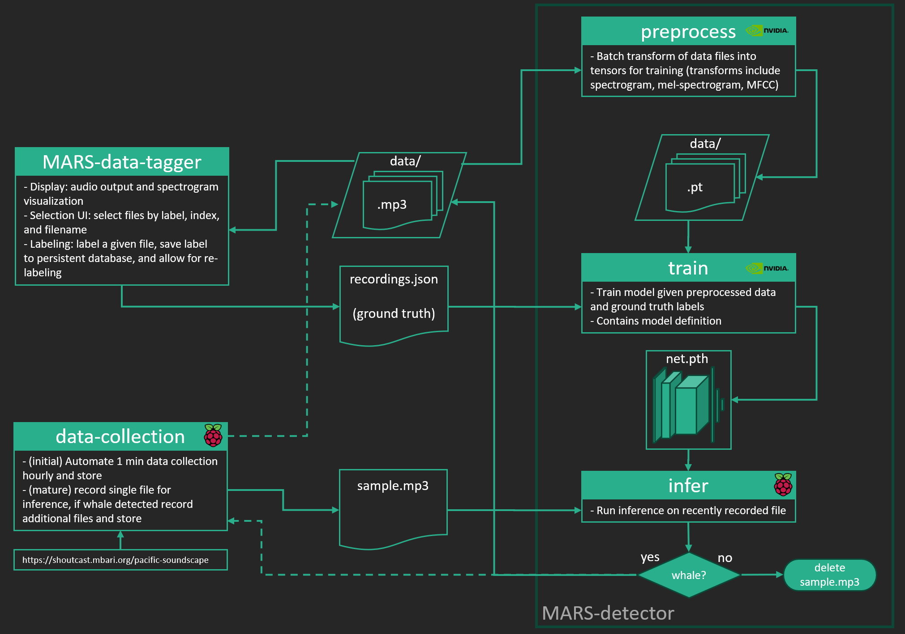

# MBARI Hydrophone Stream Monitor

This project will monitor the MBARI hydrophone stream at https://www.mbari.org/soundscape-listening-room/ and determine when humpback whales are vocalizing. 

After detecting whales, audio clips will be recorded for further analysis and an email alert will be sent out.

### data-collection 
shell scripts to collect 10 sec data snippets to build dataset, these are run at regular intervals on a rasberry pi
### MARS-data-tagger
dash webapp with the following functionality:
- data pulls from raspberry pi data collector
- spectrogram visualization and audio control
- clip labeling
- dataset statistics visualization

### MARS-detector
Services to include:
#### preprocessing
Batch transform mp3 files into pytorch tesors representing spectrograms, mel-spectrograms, or MFCC functions
#### training
Defines model architecture and contains code to load and balance datasets and train models
#### inference
Code to run inference on single file input, to be run at regular intervals on a raspberry pi to automate whale detection and follow-on data collection and alert

References:

J. Ryan et al., "New Passive Acoustic Monitoring in Monterey Bay National Marine Sanctuary," OCEANS 2016 MTS/IEEE Monterey, Monterey, CA, USA, 2016, pp. 1-8, doi: 10.1109/OCEANS.2016.7761363.
