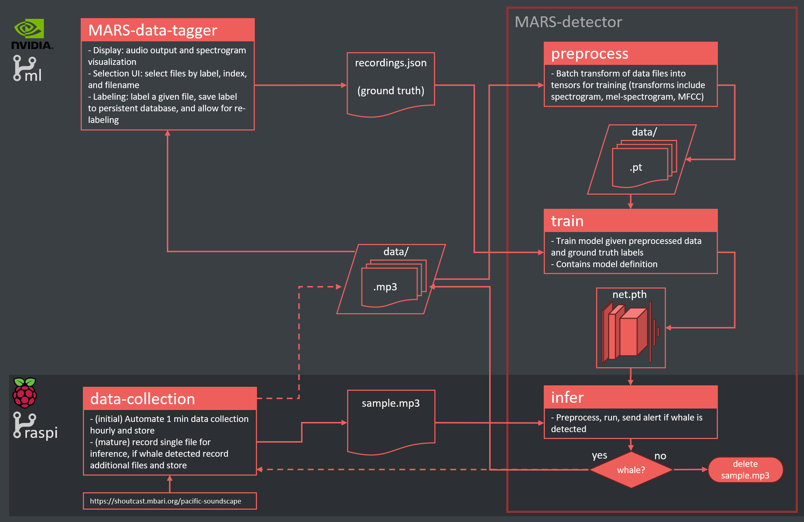

# MBARI Hydrophone Stream Monitor

This project monitors the MBARI hydrophone stream at https://www.mbari.org/soundscape-listening-room/ and determines when humpback whales are vocalizing. 

After detecting whales, audio clips are recorded for further analysis and an email alert is sent out.

*Figure 1: Project architecture showing the various code modules and data dependencies. Data tagging and model training are performed on x86 based system with GPU, see ml branch for code. Model inference and data collection completed at set intervals on Raspberry Pi, see raspi branch*

### data-collection 
This module contains shell scripts that collect 10 sec data snippets. 

In the initial stages of the project data_collect.sh was run at regular intervals (every hour) on a rasberry pi to collect a base dataset for model training.

Once the initial model was constructed, mbari_record.sh is run every 15 minutes to collect a single sample for inference. If a whale is detected the collection is called again to collect more samples for further model development and analysis.

### MARS-data-tagger
Dash webapp for data viewing and tagging.
- pulls audio clip data from raspberry pi
- provides user with spectrum visualization and clip audio
- interface to label clips for model training
- dataset statistics visualization

*Figure 2: MARS Data Tagger user interface*

### MARS-detector
Services to include:
#### preprocessing
Batch transform mp3 files into pytorch tesors representing mel-spectrograms.
#### training
Defines model architecture and contains code to handle datasets and train models.
#### inference
Code to run inference on single file input. This is primarily run on a raspberry pi at regular (15 minute) intervals to automate whale detection and follow-on data collection and alert.

References:

J. Ryan et al., "New Passive Acoustic Monitoring in Monterey Bay National Marine Sanctuary," OCEANS 2016 MTS/IEEE Monterey, Monterey, CA, USA, 2016, pp. 1-8, doi: 10.1109/OCEANS.2016.7761363.
